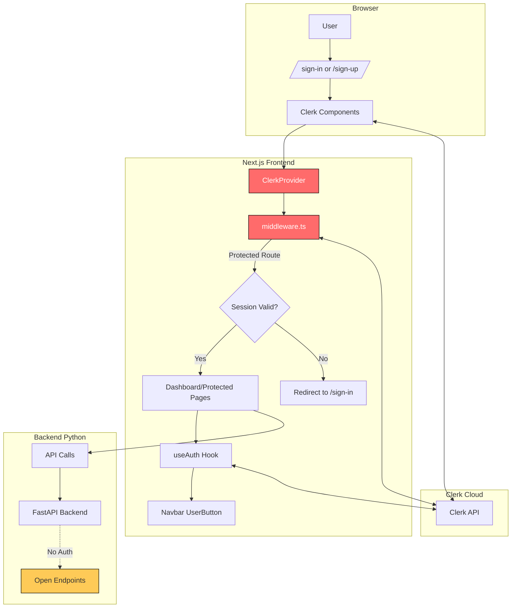

# 🔐 AUTH CONTRACT — QuantStack

> **Last Updated**: December 26, 2024  
> **Status**: 🟢 Active (Clerk-based authentication)  
> **This document is SACRED. Read it before touching ANY auth-related code.**

---

## 1. AUTH MECHANISM

### Authentication Provider
| Property | Value |
|----------|-------|
| **Provider** | [Clerk](https://clerk.com) |
| **Auth Type** | Email/Password with OAuth support (configured in Clerk Dashboard) |
| **Login Flow** | Hosted components via `@clerk/nextjs` |
| **Session Storage** | Clerk-managed (HTTP-only cookies, JWT tokens) |

### How Login Works
1. User navigates to `/sign-in` or `/sign-up`
2. Clerk's pre-built `<SignIn />` or `<SignUp />` components handle the entire flow
3. After successful auth, user is redirected to `/dashboard`
4. All subsequent requests include Clerk session cookies
5. Middleware validates session on protected routes

### Graceful Degradation
The app supports running **without** Clerk configured:
- If `NEXT_PUBLIC_CLERK_PUBLISHABLE_KEY` or `CLERK_SECRET_KEY` are missing, auth is disabled
- All routes become public
- ClerkProvider wrapper is skipped
- Navbar shows static "Get Started Free" instead of auth buttons

---

## 2. PROTECTED ROUTES

### Route Protection Matrix

| Route | Access | Protection Method |
|-------|--------|-------------------|
| `/` | 🟢 Public | Listed in `publicRoutes` |
| `/sign-in(.*)` | 🟢 Public | Listed in `publicRoutes` |
| `/sign-up(.*)` | 🟢 Public | Listed in `publicRoutes` |
| `/api/health` | 🟢 Public | Listed in `publicRoutes` |
| `/api/models(.*)` | 🟡 Ignored | Listed in `ignoredRoutes` |
| `/api/universe(.*)` | 🟡 Ignored | Listed in `ignoredRoutes` |
| `/api/status(.*)` | 🟡 Ignored | Listed in `ignoredRoutes` |
| `/dashboard` | 🔴 Protected | Requires auth via middleware |
| `/dashboard/*` | 🔴 Protected | Requires auth via middleware |
| `/admin` | 🔴 Protected + Admin | Requires auth + hardcoded admin email check |
| `/neo-dashboard` | 🔴 Protected | Requires auth via middleware |

### How Protection is Enforced

```
middleware.ts (authMiddleware)
    ↓ checks session cookie
    ↓ validates JWT with Clerk
    ↓ if invalid → redirect to /sign-in
    ↓ if valid → allow request
```

> [!CAUTION]
> The `/admin` page has an ADDITIONAL check beyond middleware. It verifies the user's email against `ADMIN_EMAILS` array. Currently hardcoded to `['email.nutty@gmail.com']`.

---

## 3. SESSION LIFECYCLE

### Session Creation
- Clerk creates session upon successful sign-in/sign-up
- Session token stored as HTTP-only cookie
- JWT contains user claims (userId, email, etc.)

### Session Validation
- `authMiddleware` from `@clerk/nextjs` validates on every protected request
- Automatic JWT verification against Clerk's backend
- Failed validation → redirect to sign-in

### Session Refresh
- Clerk handles token refresh automatically
- Silent refresh happens before token expiration
- No manual refresh logic needed

### Session Destruction (Logout)
- User clicks `<UserButton />` dropdown → "Sign out"
- Clerk clears session cookie
- `afterSignOutUrl="/"` redirects to homepage
- No manual logout endpoint needed

### Session Timeout
- Controlled by Clerk Dashboard settings
- Default: 7 days (can be configured)
- No server-side timeout logic in codebase

---

## 4. CRITICAL FILES

> [!WARNING]
> **NEVER modify these files casually.** Changes here can break ALL authentication.

### 🚨 HIGH RISK — Do Not Touch Without Review

| File | Purpose | Risk Level |
|------|---------|------------|
| [middleware.ts](file:///Users/nut/Downloads/quant-thai-stocks/frontend/src/middleware.ts) | Route protection, public/protected route list | 🔴 CRITICAL |
| [layout.tsx](file:///Users/nut/Downloads/quant-thai-stocks/frontend/src/app/layout.tsx) | ClerkProvider wrapper | 🔴 CRITICAL |
| [.env.local.example](file:///Users/nut/Downloads/quant-thai-stocks/frontend/.env.local.example) | Auth env var template | 🟠 HIGH |

### 🟡 MODERATE RISK — Modify With Care

| File | Purpose | Risk Level |
|------|---------|------------|
| [sign-in/page.tsx](file:///Users/nut/Downloads/quant-thai-stocks/frontend/src/app/sign-in/[[...sign-in]]/page.tsx) | Sign-in page & Clerk component styling | 🟡 MODERATE |
| [sign-up/page.tsx](file:///Users/nut/Downloads/quant-thai-stocks/frontend/src/app/sign-up/[[...sign-up]]/page.tsx) | Sign-up page & Clerk component styling | 🟡 MODERATE |
| [Navbar.tsx](file:///Users/nut/Downloads/quant-thai-stocks/frontend/src/app/components/Navbar.tsx) | Auth state display, UserButton, Sign In/Up links | 🟡 MODERATE |
| [admin/page.tsx](file:///Users/nut/Downloads/quant-thai-stocks/frontend/src/app/admin/page.tsx) | Admin access control (hardcoded emails) | 🟡 MODERATE |

### 🟢 LOW RISK — Safe to Modify

| File | Purpose | Risk Level |
|------|---------|------------|
| [dashboard/page.tsx](file:///Users/nut/Downloads/quant-thai-stocks/frontend/src/app/dashboard/page.tsx) | Protected page (no auth logic) | 🟢 LOW |
| [neo-dashboard/page.tsx](file:///Users/nut/Downloads/quant-thai-stocks/frontend/src/app/neo-dashboard/page.tsx) | Protected page prototype (no auth logic) | 🟢 LOW |

---

## 5. ENV VARS FOR AUTH

### Required Environment Variables

```bash
# REQUIRED — Authentication will NOT work without these
NEXT_PUBLIC_CLERK_PUBLISHABLE_KEY=pk_test_your_key_here
CLERK_SECRET_KEY=sk_test_your_key_here
```

### Optional but Recommended

```bash
# URL Configuration (defaults will work if omitted)
NEXT_PUBLIC_CLERK_SIGN_IN_URL=/sign-in
NEXT_PUBLIC_CLERK_SIGN_UP_URL=/sign-up
NEXT_PUBLIC_CLERK_AFTER_SIGN_IN_URL=/dashboard
NEXT_PUBLIC_CLERK_AFTER_SIGN_UP_URL=/dashboard
```

### Where to Get Keys
1. Go to [Clerk Dashboard](https://dashboard.clerk.com)
2. Select your application
3. Navigate to **API Keys** in the sidebar
4. Copy **Publishable key** → `NEXT_PUBLIC_CLERK_PUBLISHABLE_KEY`
5. Copy **Secret key** → `CLERK_SECRET_KEY`

### Callback URLs in Clerk Dashboard
Configure these in Clerk Dashboard → **Paths**:
- Sign-in URL: `/sign-in`
- Sign-up URL: `/sign-up`
- After sign-in URL: `/dashboard`
- After sign-up URL: `/dashboard`

> [!IMPORTANT]
> For production, add your domain to **Allowed Origins** in Clerk Dashboard.

---

## 6. AUTH SMOKE TEST

### Prerequisites
- Dev server running: `npm run dev` (from `/frontend`)
- Valid Clerk keys in `.env.local`

### Test Procedure

| Step | Action | Expected Result |
|------|--------|-----------------|
| 1 | Navigate to `/sign-up` | See Clerk sign-up form |
| 2 | Sign up with new email | Verification email sent (if enabled) OR redirected to `/dashboard` |
| 3 | Complete verification (if applicable) | Redirected to `/dashboard` |
| 4 | Navigate to `/dashboard` | Dashboard loads, Navbar shows UserButton |
| 5 | Hard refresh page (Cmd+Shift+R) | Still logged in, session persists |
| 6 | Click UserButton → Sign out | Redirected to `/` |
| 7 | Try navigating to `/dashboard` directly | Redirected to `/sign-in` |
| 8 | Navigate to `/sign-in` | See Clerk sign-in form |
| 9 | Sign in with existing account | Redirected to `/dashboard` |
| 10 | (If you're `email.nutty@gmail.com`) Navigate to `/admin` | See Admin Dashboard |
| 11 | (If NOT admin email) Navigate to `/admin` | See "Access Denied" message |

### Password Reset Flow
1. Go to `/sign-in`
2. Click "Forgot password?" link (Clerk provides this)
3. Enter email → Receive reset link
4. Click reset link → Set new password
5. Sign in with new password

> [!NOTE]
> Password reset is fully managed by Clerk. No custom logic in codebase.

---

## 7. KNOWN AUTH FRAGILITIES

### 🚨 Past Breakages

| Issue | Root Cause | How it Was Fixed |
|-------|------------|------------------|
| "Client not found" errors | Stale Clerk provider context | Added graceful fallback when Clerk not configured |
| Navbar flashing | `useAuth()` called before ClerkProvider mounted | Wrapped with conditional check for `NEXT_PUBLIC_CLERK_PUBLISHABLE_KEY` |
| Build failures | Clerk hooks used outside ClerkProvider | Dynamic import of Clerk with try/catch in Navbar |

### ⚠️ Risky Areas

1. **Navbar.tsx Dynamic Imports**
   - Uses `require()` with try/catch for Clerk
   - Fragile pattern — any import error silently fails
   - Could cause auth UI to disappear without errors

2. **Admin Email Hardcoding**
   - Admin emails hardcoded in `/admin/page.tsx`
   - Easy to forget to update
   - Should move to env var or Clerk metadata

3. **Middleware Route List**
   - Easy to forget to add new protected routes
   - New API routes default to protected (safer default)

4. **No Backend Auth**
   - Backend APIs are completely open
   - No JWT validation on Python backend
   - Anyone can call backend directly

### ✅ What Must Be Tested After Any Auth Change

```bash
# Quick Smoke Test Checklist
[ ] Can sign up new user?
[ ] Can sign in existing user?
[ ] Does session persist on refresh?
[ ] Can access /dashboard when logged in?
[ ] Is /dashboard blocked when logged out?
[ ] Does sign out work?
[ ] Does /admin block non-admin users?
[ ] Does Navbar show correct state (signed in vs out)?
[ ] Does app work when Clerk keys are removed?
```

---

## Architecture Diagram



---

## Quick Reference

```bash
# Start dev server
cd frontend && npm run dev

# Check if Clerk is configured
echo $NEXT_PUBLIC_CLERK_PUBLISHABLE_KEY

# View middleware
cat src/middleware.ts

# View protected routes config
grep -A 10 "publicRoutes" src/middleware.ts
```

---

> [!CAUTION]
> **BEFORE MODIFYING ANY AUTH CODE:**
> 1. Read this contract
> 2. Run the smoke test
> 3. Test WITH and WITHOUT Clerk keys configured
> 4. Update this contract if you change anything
